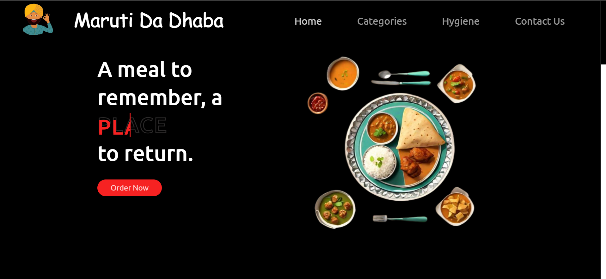

# Maruti Da Dhaba

Welcome to the **Maruti Da Dhaba** project! This is a website for a fictional restaurant, showcasing various food categories, hygiene practices, and a contact form for users to reach out. The website has a responsive design with a hamburger navigation menu for mobile devices.

## 📷 Landing Page 📷 


## Table of Contents
- [Description](#description)
- [Features](#features)
- [Technologies Used](#technologies-used)
- [Installation](#installation)
- [Usage](#usage)
- [Contributing](#contributing)
- [License](#license)

## Description

**Maruti Da Dhaba** is a beautifully designed website that serves as the online presence for a fictional dhaba (restaurant). The website includes:
- A homepage showcasing various food categories.
- A hygiene section to highlight the importance of cleanliness.
- A contact section to allow users to get in touch.
- A modern, responsive navigation bar with a burger menu for mobile users.

## Features
- **Responsive Navigation**: The website features a mobile-friendly navigation bar that transforms into a hamburger menu on smaller screens.
- **Navigation Bar**: Links to Home, Categories, Hygiene, and Contact Us sections.
- **Clean Design**: Simple, elegant layout using flexbox for layout management.
- **Cross-device Compatibility**: The website adapts to different screen sizes (desktop, tablet, and mobile).
- **Smooth Transitions**: Hover effects on navigation links and smooth transformations for interaction.

## Technologies Used
This project is built using the following technologies:
- **HTML**: For the structure and content of the website.
- **CSS**: For styling the website and creating a responsive design.
- **JavaScript**: For the hamburger menu toggle functionality in mobile view.
- **Flexbox**: Used to create flexible layouts and manage the positioning of elements.

## Installation

To run this project locally, follow these steps:

1. Clone the repository:
   ```bash
   git clone https://github.com/adarsh3002/Maruti-Da-Dhaba.git
